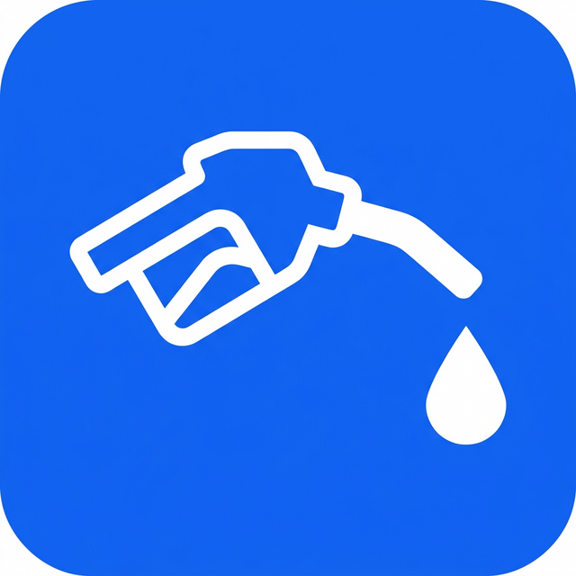
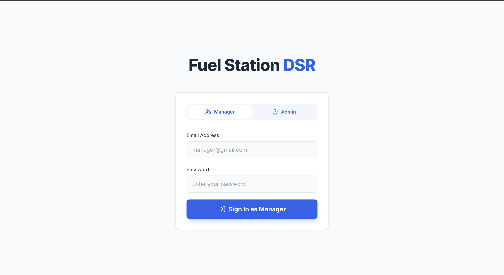
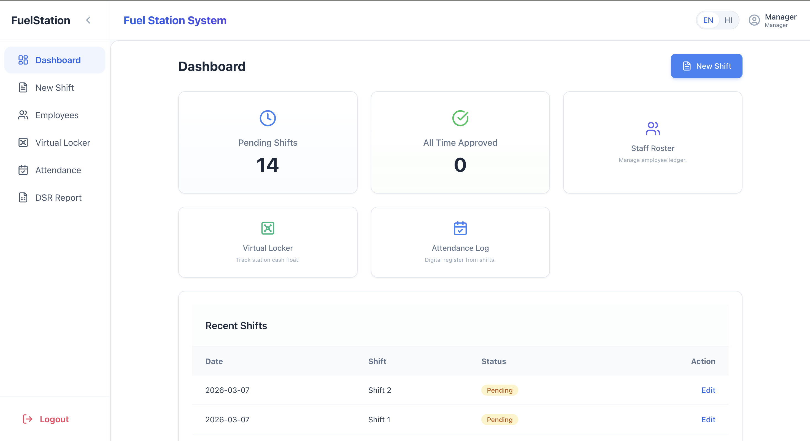
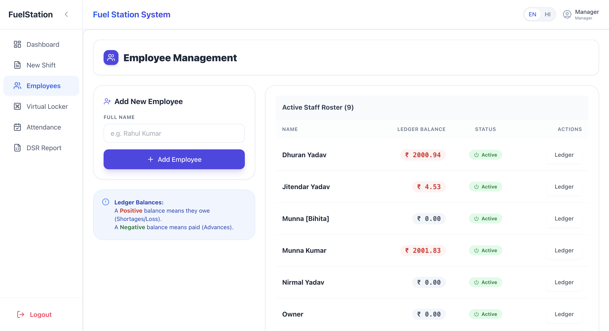
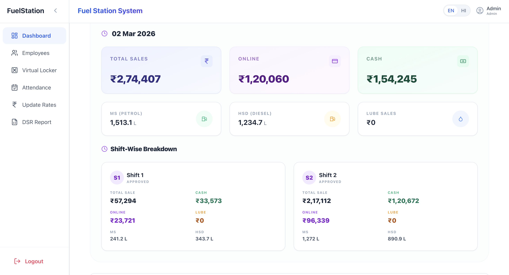
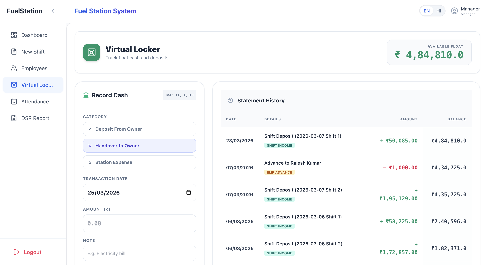
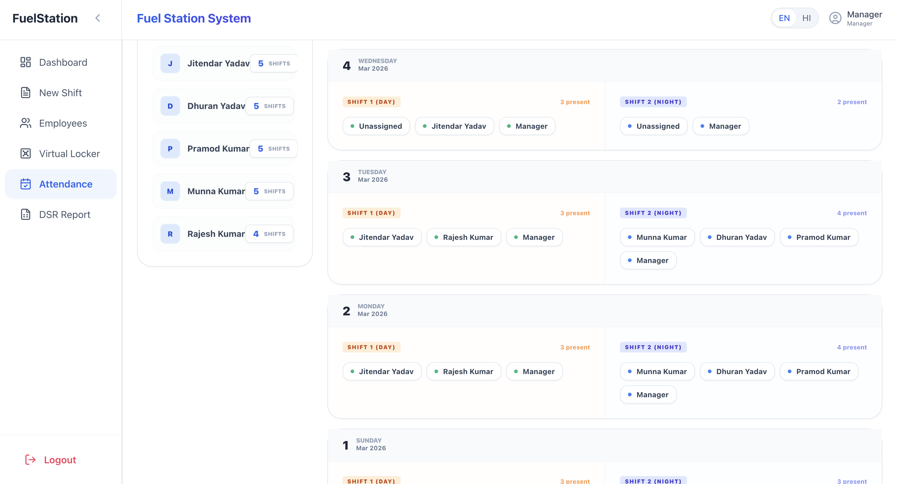
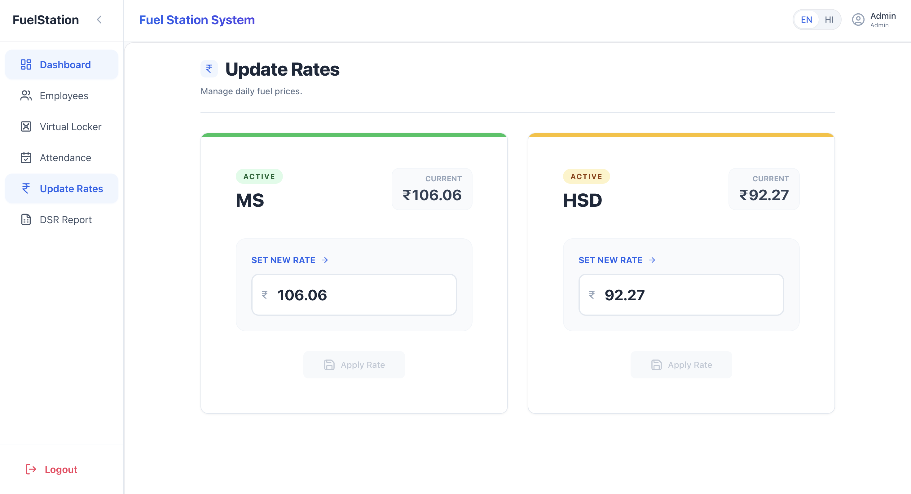

<div align="center">
  
  
  <h1 style="border-bottom: none; margin-bottom: 0;">⛽ Fuel Station OS</h1>
  <p><strong>The Next-Gen, "Vibe Coded" Operating System for Modern Fuel Stations</strong></p>
  
  <p>
    <a href="#overview">Overview</a> •
    <a href="#the-vibe">The Vibe</a> •
    <a href="#features">Features</a> •
    <a href="#technical-stack">Tech Stack</a> •
    <a href="#getting-started">Getting Started</a>
  </p>
</div>

---

<div align="center">
  
</div>

## 🌐 Overview
Fuel Station OS is an **end-to-end B2B SaaS** built specifically to eradicate the nightmare of manual fuel station management. We replace error-prone logbooks, chaotic cash collections, and stressful shift handovers with a fully digital, real-time operating system. 

Designed from the ground up for the chaotic, zero-downtime environment of a gas station, the UI isn’t just functional—it’s **fast, intuitive, and relentlessly beautiful**.

<div align="center">
  
  
</div>

<br/>

## ✨ The "Vibe"
Enterprise software usually feels like doing taxes. Fuel Station OS was **vibe-coded** to feel like a consumer app. We obsess over the micro-interactions:
- **Glassmorphism elements** bridging data layers.
- **Fluid transitions** smoothing the cognitive load for tired managers closing out 12-hour shifts.
- **Crisp typography & spacious layouts**, turning mountains of financial numbers into scannable insights.
- **Color-coded operational health states** (Emerald for accurate balances, Red for cash discrepancies).

<div align="center">
  
  <p><em>Fully automated Daily Sales Report (DSR) computing complex tank dips and nozzle shifts instantly.</em></p>
</div>

## 🚀 Key Features

*   **🔒 Intelligent Shift Vaults:** Total mathematical traceability for cash, online payments, and lube sales. The app flags discrepancies down to the cent instantly.
*   **📊 Automatic Forward-Looking DSR:** Real-time Daily Sales Reports dynamically generated by reconciling "Shift 1" and "Shift 2" start-of-day opening meters and end-of-day tank dips. No math required from the station owner.
*   **👥 Role-Based Access Control (RBAC):** Station Managers capture exact operations and shifts, while the Admin/Owner gets an eagle-eye view of revenue, profitability, and pending approvals securely.
*   **📑 Audit-Ready PDF Generation:** Instantly export pristine PDFs for compliance, accounting, or historical banking records.
*   **📱 Progressive Web App (PWA):** Flawless native-like experience on iOS and Android devices directly on the station forecourt.

<div align="center">
  
  
</div>

<br/>

## 🛠️ Technical Stack
Architected for ultimate speed, resilience, and scale:
*   **Frontend**: Next.js 14 (App Router), React, TailwindCSS, Lucide Icons
*   **Backend / DB**: Supabase (PostgreSQL), Edge Functions, Row Level Security
*   **Deployment**: Vercel (Edge-first architecture)
*   **Utilities**: date-fns (Timezones), Zustand (State)

<div align="center">
  
</div>

## 🏁 Getting Started

```bash
# 1. Clone the repository
git clone https://github.com/yourusername/fuel_station.git

# 2. Install dependencies
npm install

# 3. Configure environment
# Copy .example.env to .env.local and add your Supabase keys
cp .example.env .env.local

# 4. Spin up the dev environment
npm run dev
```

---

<p align="center">
  <em>Built for scale. Designed with absolute vibe. ⛽</em>
</p>
